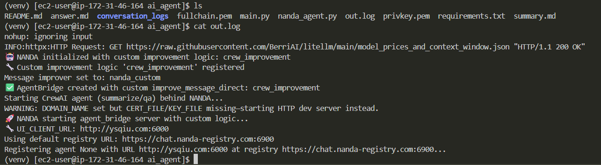

# CrewAI × NANDA Bridge — Summarize & Q&A Agent

A minimal **CrewAI** agent exposed via a **NANDA** bridge. It registers with the NANDA registry and serves two capabilities:

- **Summarize:** turn text into crisp, structured bullets  
- **Q&A:** answer a question using provided context (and optional web search)

All orchestration lives in a single file: **`nanda_agent.py`**, which uses your **`nanda_adapter.NANDA`** bridge.

Below is the screenshot showing that my registry is successful and I received the link:


---

## Deployment Context

- **Domain:** I own `ysqiu.com` via Namecheap and point it to my EC2 instance.  
- **Infrastructure:** Amazon Linux EC2 instance, following setup instructions.  

---

## How It Decides What To Do

Incoming message parsing (in order):

1. **JSON payload** (preferred)
   - `{"mode":"summarize","text":"..."}`
   - `{"mode":"qa","question":"...","context":"..."}`

2. **Command prefixes**
   - `summarize: <text>`
   - `qa: <question> ::: <optional context>`

3. **Fallback:** runs a small **demo** (summarize + Q&A).

---

## Agents & Tasks (CrewAI)

- **Concise Summarizer**  
  Role: distill text into short, plain-language bullets with headers (preserve key names/numbers).  
  Tools: `FileWriterTool()`

- **Practical Q&A Specialist**  
  Role: answer directly using context; if insufficient and search is available, do a brief search and synthesize.  
  Tools: `FileWriterTool()`, `SerperDevTool()` *(enabled only if `SERPER_API_KEY` is set)*

Both run **sequentially** in demo mode via `Crew(…, process=Process.sequential)`.

---

## Environment Variables

Recommended (set what you need):

- `OPENAI_API_KEY` — used by CrewAI/OpenAI tools   
- `DOMAIN_NAME` — e.g., `ysqiu.com`; if set **with** cert paths, HTTPS is enabled in-app  
- `CERT_FILE`, `KEY_FILE` — absolute paths to TLS cert & key for in-app HTTPS (e.g., Let’s Encrypt)  
- `REGISTRY_URL` — NANDA registry base (overridden by `registry_url.txt` if present)

> If `DOMAIN_NAME` is set **without** `CERT_FILE`/`KEY_FILE`, the app falls back to **HTTP dev server** and prints a warning.

---

# Deployment Steps

### 1. Connect to the Server
```bash
ssh -i <YOUR_PEM_KEY> ec2-user@<EC2_PUBLIC_IP>
```

### 2. Update System Packages & Install Dependencies
```bash
sudo dnf update -y
sudo dnf install -y python3.11 python3.11-pip certbot
```

### 3. Create and Activate a Virtual Environment
Navigate to the project folder (where your files are stored) and run:
```bash
python3.11 -m venv <YOUR_ENV_NAME>
source <YOUR_ENV_NAME>/bin/activate
```

### 4. Generate SSL Certificates
Ensure your domain name points to this EC2 instance. Then run:
```bash
sudo certbot certonly --standalone -d <YOUR_DOMAIN_NAME>
```

### 5. Copy Certificates Into Project Folder
Replace `<YOUR_DOMAIN_NAME>` with your actual domain:
```bash
sudo cp -L /etc/letsencrypt/live/<YOUR_DOMAIN_NAME>/fullchain.pem .
sudo cp -L /etc/letsencrypt/live/<YOUR_DOMAIN_NAME>/privkey.pem .
sudo chown $USER:$USER fullchain.pem privkey.pem
chmod 600 fullchain.pem privkey.pem
```

### 6. Install Python Requirements
```bash
python -m pip install --upgrade pip
pip install -r requirements.txt
```

### 7. Configure Environment Variables
Export the required environment variables (see Environment Variables section in README for details):
```bash
export OPENAI_API_KEY="sk-..."
export DOMAIN_NAME="<YOUR_DOMAIN_NAME>"
export CERT_FILE="$(pwd)/fullchain.pem"
export KEY_FILE="$(pwd)/privkey.pem"
```

### 8. Run the Agent as a Background Process
```bash
nohup python3 nanda_agent.py > out.log 2>&1 &
```

### 9. Check Logs for Enrollment Link
```bash
cat out.log
```
Look for a printed URL containing your `agentId`.

### 10. Register the Agent
Copy the enrollment link from the log output and open it in your browser to complete registration.


## Registry URL Resolution

`nanda_agent.py` chooses the registry URL by:
1. `registry_url.txt` (if present in CWD), else
2. `REGISTRY_URL` env var, else
3. default `https://chat.nanda-registry.com`

It prints which source it used.


## 🤖 AI Assistance Acknowledgment
Approximately **80% of the code was generated with AI assistance** (ChatGPT / GPT-5).  
---

